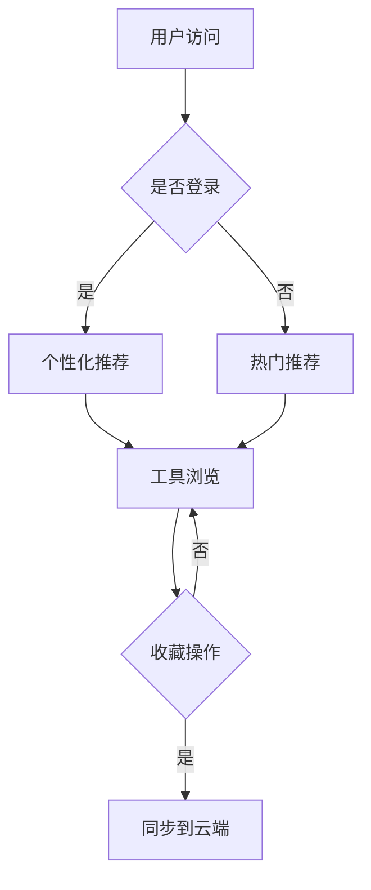

# Chat-AI-Nav 技术设计文档

## 一、基本概念体系

### 1.1 核心实体

#### 工具（Tool）
- 唯一标识：UUID
- 基础属性：名称、描述、图标、URL
- 元数据：分类、标签、评分
- 统计数据：访问量、收藏数

#### 用户（User）
- 账号体系：邮箱/手机号注册
- 偏好设置：语言、主题、通知
- 数据同步：云端存储策略

#### 收藏夹（Collection）
- 组织形式：文件夹结构
- 同步机制：增量更新
- 版本控制：操作历史

### 1.2 业务流程



## 二、技术架构

### 2.1 前端架构

#### 技术栈选型
- 框架：Next.js 13+
- 状态管理：Redux Toolkit
- UI组件：Tailwind CSS
- 构建工具：Webpack 5

#### 性能优化
- 路由预加载
- 组件懒加载
- 图片优化策略
- 缓存控制

### 2.2 后端架构

#### 服务层设计
- RESTful API
- GraphQL 接口
- WebSocket 实时通信

#### 数据持久化
- 主数据库：PostgreSQL
- 缓存层：Redis
- 搜索引擎：Elasticsearch

## 三、数据模型

### 3.1 数据库设计

```sql
-- 工具表
CREATE TABLE tools (
    id UUID PRIMARY KEY,
    name VARCHAR(100) NOT NULL,
    description TEXT,
    icon_url VARCHAR(255),
    category_id UUID,
    created_at TIMESTAMP,
    updated_at TIMESTAMP
);

-- 用户表
CREATE TABLE users (
    id UUID PRIMARY KEY,
    email VARCHAR(255) UNIQUE,
    password_hash VARCHAR(255),
    preferences JSONB,
    created_at TIMESTAMP
);

-- 收藏表
CREATE TABLE collections (
    id UUID PRIMARY KEY,
    user_id UUID,
    tool_id UUID,
    folder_path VARCHAR(255),
    created_at TIMESTAMP,
    FOREIGN KEY (user_id) REFERENCES users(id),
    FOREIGN KEY (tool_id) REFERENCES tools(id)
);
```

### 3.2 缓存策略

#### Redis 键值设计
- 工具热度：`tool:hot:{tool_id}`
- 用户会话：`session:{user_id}`
- 搜索建议：`suggest:{keyword}`

## 四、接口设计

### 4.1 RESTful API

#### 工具相关
```typescript
interface Tool {
    id: string;
    name: string;
    description: string;
    iconUrl: string;
    category: string;
    tags: string[];
    stats: {
        views: number;
        favorites: number;
    };
}

// GET /api/tools
// GET /api/tools/{id}
// POST /api/tools
// PUT /api/tools/{id}
// DELETE /api/tools/{id}
```

#### 用户相关
```typescript
interface User {
    id: string;
    email: string;
    preferences: {
        language: string;
        theme: 'light' | 'dark';
        notifications: boolean;
    };
}

// POST /api/auth/login
// POST /api/auth/register
// GET /api/users/me
// PUT /api/users/me
```

### 4.2 WebSocket 事件

```typescript
interface WebSocketEvent {
    type: 'COLLECTION_UPDATE' | 'TOOL_UPDATE';
    payload: any;
    timestamp: number;
}
```

## 五、状态管理

### 5.1 Redux Store 设计

```typescript
interface RootState {
    auth: {
        user: User | null;
        token: string | null;
        loading: boolean;
    };
    tools: {
        items: Tool[];
        loading: boolean;
        error: string | null;
    };
    collections: {
        items: Collection[];
        syncing: boolean;
    };
}
```

### 5.2 状态流转

#### 工具收藏流程
1. 触发收藏动作
2. 更新本地状态
3. 发起API请求
4. 等待响应后同步
5. 触发WebSocket通知

## 六、安全设计

### 6.1 认证授权

#### JWT配置
- 令牌有效期：2小时
- 刷新令牌：7天
- 签名算法：HS256

#### 权限控制
- 基于RBAC模型
- 细粒度API权限
- 资源访问控制

### 6.2 数据安全

#### 传输安全
- HTTPS强制
- API请求签名
- 敏感数据加密

#### 存储安全
- 密码哈希：Bcrypt
- 字段加密：AES-256
- 数据备份策略

## 七、监控告警

### 7.1 监控指标

#### 性能指标
- 接口响应时间
- 页面加载时间
- 资源使用率

#### 业务指标
- DAU/MAU
- 功能使用率
- 错误发生率

### 7.2 告警规则

#### 触发条件
- API错误率 > 1%
- 响应时间 > 2s
- CPU使用率 > 80%

#### 通知方式
- 邮件通知
- Slack集成
- 短信告警

## 八、部署方案

### 8.1 环境配置

#### 开发环境
- 本地开发服务器
- 模拟数据
- 热重载

#### 生产环境
- 容器化部署
- 负载均衡
- CDN加速

### 8.2 CI/CD流程

#### 构建流程
1. 代码检查
2. 单元测试
3. 构建打包
4. 镜像制作

#### 部署流程
1. 环境准备
2. 配置注入
3. 服务启动
4. 健康检查

## 九、测试策略

### 9.1 测试类型

#### 单元测试
- 组件测试
- 工具函数测试
- 接口测试

#### 集成测试
- 功能流程测试
- 性能测试
- 兼容性测试

### 9.2 测试覆盖率

#### 覆盖率目标
- 单元测试：80%
- 集成测试：60%
- E2E测试：40%

## 十、文档规范

### 10.1 代码规范

#### TypeScript规范
- 强类型定义
- 接口优先
- 函数式编程

#### 命名规范
- 变量：camelCase
- 类型：PascalCase
- 常量：UPPER_CASE

### 10.2 注释规范

#### 代码注释
- 函数注释
- 复杂逻辑说明
- TODO标记

#### API文档
- OpenAPI规范
- 参数说明
- 示例代码