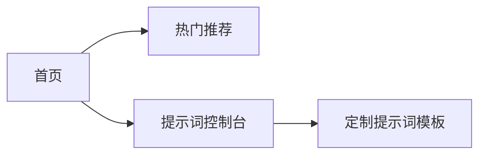

# Chat-AI-Nav 产品设计文档

## 目录

1. [产品概述](#1-产品概述)
2. [用户角色与使用场景](#2-用户角色与使用场景)
3. [核心功能与交互流程](#3-核心功能与交互流程)
4. [竞品对标分析](#4-竞品对标分析)
5. [实施计划与验收标准](#5-实施计划与验收标准)
6. [基础概念定义](#6-基础概念定义)
7. [信息架构设计](#7-信息架构设计)

---

## 1. 产品概述

**定位：** 专注于ChatBot类AI工具的聚合平台，着重于提示词定制。

**核心价值：**

- 快速发现优质AI工具（<20秒响应）
- 精准语义搜索匹配
- 提示词定制与跨平台管理

---

## 2. 用户角色与使用场景

| 角色 | 核心诉求 | 使用场景说明 |
| --- | --- | --- |
| 新手用户 | 快速体验热门ChatAI工具 | 首页 → 热门推荐 → 直接访问 |
| 深度用户 | 定制提示词模板 | **提示词控制台** → 定制提示词模板 → 应用优化 |
| 开发者 | 监控工具更新与账号管理 | 个人中心 → 管理账号及跨平台收藏 |

---

## 3. 核心功能与交互流程

**核心功能：**

- **提示词控制台：** 深度用户可以定制、调整并发布提示词模板。
- **统一搜索：** 基于语义匹配检索相关ChatAI工具与提示词模板。
- **跨平台管理：** 支持账号信息、收藏夹与个性化设置同步。

**交互流程示意：**

---

## 4. 竞品对标分析

| 功能项 | 我们的产品 | 竞品A (Futurepedia) | 竞品B (There's An AI For That) |
| --- | --- | --- | --- |
| 提示词定制 | 深度定制提示词模板，内嵌控制台 | 提示词功能较基础 | 提示词支持有限 |
| 分类精准度 | 统一三级分类，精确匹配 | 分类较粗 | 分类不够细致 |
| 跨平台同步 | 全面账号及收藏夹同步 | 收藏功能单一 | 收藏数据更新不及时 |

---

## 5. 实施计划与验收标准

**实施计划：**

- **MVP（2周）：** 完成基础首页、热门列表与提示词控制台。
- **1.1版本（+1周）：** 添加账号管理与收藏同步功能。

**验收标准：**

- 核心功能路径100%测试通过。
- 首页加载时间≤1.5秒，搜索响应≤1秒。
- 跨平台体验流畅（移动端评分≥4.5/5）。

---

## 6. 基础概念定义

| 概念名称 | 定义说明 |
| --- | --- |
| **ChatAI/提示词卡片** | 展示单个ChatAI的基本信息和logo。可点击查看详情、跳转到具体网站，并支持用户收藏。 |
| **三级筛选器** | 根据标签、收藏、热度和名称对ChatAI进行多维度筛选和排序。 |
| **搜索器** | 检索ChatAI的标签库中与用户输入相关度最高的10个ChatAI并展示。用户通过自然语言描述需求，系统根据ChatAI的tag计算相关度，并展示得分最高的前十个。 |
| **个人偏好设置** | 编辑并存储个人ChatAI账号信息、字体大小等，数据存储于用户本地数据库或缓存中。 |
| **提示词工作台** | 创作或配置他人创作的提示词。支持在提示词工坊收藏他人提示词，可选择适用模型，并发布到提示词工坊。 |

---

## 7. 信息架构设计

### 7.1 组件信息结构

| 组件名 | 信息结构 |
| --- | --- |
| **ChatAI/提示词卡片** | 1. id/name 2. logo_path 3. desc 4. tags 5. url |
| **三级筛选器** | 1. tags 2. hotness 3. name 4. isFavorite 5. isAscend 6. isContained |
| **搜索器** | 1. demand |
| **个人偏好设置** | 1. username 2. password 3. font_size |
| **提示词工作台** | 1. name 2. logo_path 3. content 4. placeholder_pos 5. isPublic 6. isFavorite |

### 7.2 页面信息结构

| 页面名 | 基本概念 | 功能描述 | 信息结构 |
| --- | --- | --- | --- |
| **ChatAI发现页** | 所有ChatAI卡片的展示及交互入口 | 浏览所有ChatAI卡片，可筛选和搜索；支持收藏、查看详情、跳转网站及设置账号 | 1. click_count 2. chat_ais |
| **提示词工坊** | 所有提示词模板卡片的展示及交互 | 浏览创作者发布的提示词模板，支持复制模板、设置及创作发布 | 1. click_count 2. prompt_templates |
| **首页** | 热门、收藏及推荐的ChatAI和提示词模板展示 | 展示热度前6的、用户收藏的、推荐的ChatAI卡片和提示词模板 | N/A |
